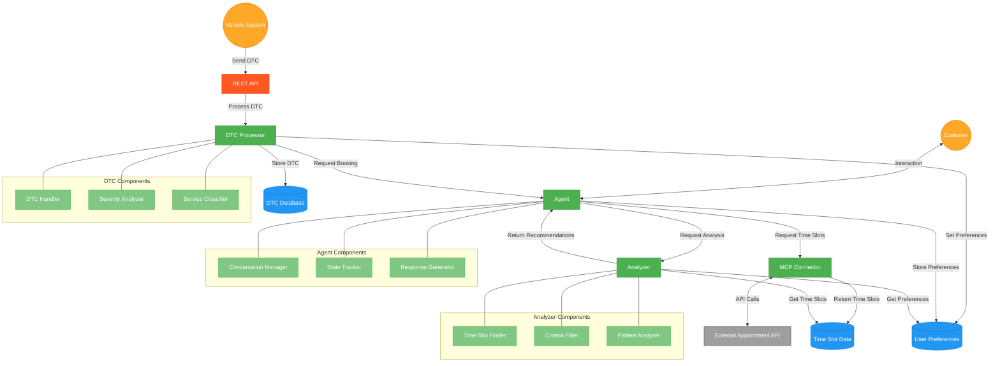

# Appoint-a-Bot Architecture

This document outlines the architecture of the Appoint-a-Bot appointment scheduling system.

## System Components

The system consists of four main components:

1. **MCP Connector**: Responsible for retrieving time slots from an external service
2. **Analyzer**: Processes time slots to find the most suitable options
3. **Agent**: Manages customer interaction and coordinates the booking workflow
4. **DTC Module**: Processes vehicle diagnostic trouble codes and triggers automatic bookings via REST API

## Architecture Diagram

## Component Descriptions

### MCP Connector
- Establishes communication with external appointment services
- Handles API authentication and data retrieval
- Formats raw time slot data for internal use

### Analyzer
- **Time Slot Finder**: Identifies the closest time slots to requested times
- **Criteria Filter**: Filters time slots based on user-specified criteria
- **Pattern Analyzer**: Analyzes availability patterns to provide insights

### Agent
- **Conversation Manager**: Handles the flow of interaction with the customer
- **State Tracker**: Maintains the state of the booking conversation
- **Response Generator**: Creates appropriate responses based on available data

### DTC Module
- **DTC Processor**: Analyzes diagnostic trouble codes and determines appointment urgency
- **REST API**: Receives DTC data from vehicle systems and returns booking confirmations
- **Service Classifier**: Determines the type of service needed based on the DTC
- **Severity Analyzer**: Assesses the severity of issues and recommends appointment timeframes

## Data Flow

### Manual Booking Flow
1. The Customer interacts with the Agent to request appointment booking
2. The Agent stores customer preferences and forwards them to the MCP Connector
3. The MCP Connector retrieves available time slots from the external API
4. The Analyzer applies filters and finds the most suitable time slots
5. The Agent presents recommendations to the Customer
6. Based on customer feedback, the process iterates until a booking is confirmed

### DTC-Triggered Booking Flow
1. Vehicle systems send diagnostic trouble codes to the REST API
2. The DTC Processor analyzes the code to determine appointment urgency
3. Based on the severity, the DTC Processor sets appointment preferences
4. The Agent retrieves time slots via the MCP Connector
5. The Analyzer filters and recommends the most suitable time slot
6. The Agent automatically confirms the booking
7. The REST API returns the booking confirmation to the external system

## Future Enhancements

Potential future enhancements to the architecture:
- Add a persistent storage layer for user preferences and history
- Integrate machine learning components for predictive recommendations
- Implement support for multiple external appointment systems
- Add real-time notifications for appointment changes
- Implement predictive maintenance by analyzing DTC patterns over time 